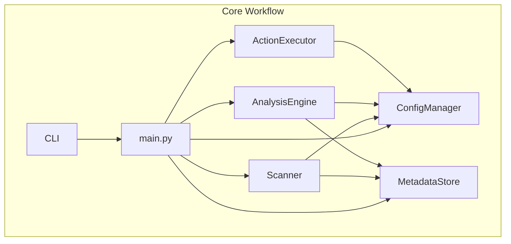

# Product Context
<!-- Entries below should be added reverse chronologically (newest first) -->

# System Patterns
<!-- Entries below should be added reverse chronologically (newest first) -->
### Dependency Map (Current - Overwrite this section) - 2025-04-29 23:45:11

### [2025-04-29 18:51:04] Initial Architecture: Storage Hygiene System
- **Description:** A modular system for scanning, analyzing, reviewing, and acting upon files across local and cloud storage. Components include Scanner, Analysis Engine, UI, Executor, Config Manager, and optional AI Assistant.
- **Diagram:** [See Architect Specific Memory Diagram: Storage Hygiene System - 2025-04-29 18:51:04]
- **Key Patterns:** Service-based architecture, separation of concerns (scanning, analysis, action), configuration-driven rules, secure credential management (OS Keychain), scalable metadata storage (DuckDB), parallel processing, incremental scanning, detailed analysis categories (including similarity).
<!-- Entries below should be added reverse chronologically (newest first) -->

### [2025-04-29 19:46:07] System Pattern Refinement: Storage Hygiene System (CLI Focused)
- **Description:** Revised architecture focusing on a CLI-only interface, generalized migration rules, and enhanced detail. Incorporates detailed analysis categories, DuckDB for metadata, OS Keychain for secrets, parallel/incremental scanning, and content-based similarity checks. Addresses scalability, security, cross-platform requirements, modularity, and SPARC/TDD principles more explicitly.
- **Diagram:** [See Architect Specific Memory Diagram: Storage Hygiene System (CLI Detailed) - 2025-04-29 19:46:07]
- **Related Decisions:** [See Decision Log entries for 2025-04-29 19:34:11 and 2025-04-29 19:46:07]

### [2025-04-29 18:51:19] Architectural Approach: Modular Services
- **Decision:** Adopt a modular, service-based architecture for the Storage Hygiene System.
- **Rationale:** Enhances maintainability, testability, and allows for independent development/scaling of components (Scanner, Analyzer, UI, Executor). Facilitates potential future replacement or addition of components (like the AI Assistant).
- **Alternatives Considered:** Monolithic script (rejected due to complexity and lack of scalability).
- **Related Patterns:** [See System Pattern: Initial Architecture - 2025-04-29 18:51:04]
# Decision Log
<!-- Entries below should be added reverse chronologically (newest first) -->

### [2025-04-29 20:19:26] Decision: Mandatory Git Commits on Task Success
- **Decision:** Modes modifying project files (code, docs, etc.) must commit project changes AND memory-bank updates in two separate commits upon successful task completion and verification.
- **Rationale:** Ensures version control hygiene, links project state to memory bank state, and provides clear history.
- **Implementation:** SPARC orchestrator will include explicit instructions in `new_task` messages for relevant modes.
### [2025-04-29 19:34:11] Decision: AI Integration Timing
- **Decision:** Implement AI Organization Assistant as a Post-MVP feature.
- **Rationale:** Core functionality (duplicate/large/old file detection, migration) provides significant value independently. Deferring AI complexity allows focus on core stability, performance, and user experience first. Reduces initial development scope and potential costs (API usage).
- **Alternatives Considered:** Integrate AI in V1 (rejected due to complexity and non-core nature).
- **Related Components:** AI Organization Assistant, Analysis Engine.

### [2025-04-29 19:46:07] Decision: Generalized Migration Rules
- **Decision:** Implement a flexible rule engine for defining migration tasks, rather than hardcoding specific source/destination pairs (like OneDrive -> GDrive). Rules will specify source location(s), destination location, and filtering criteria (file types, size, age, patterns, etc.).
- **Rationale:** Provides much greater flexibility for the user to define various migration/backup scenarios between different supported local or cloud locations. Avoids hardcoding specific use cases. Aligns with user feedback requesting generalization.
- **Alternatives Considered:** Hardcoded migration paths (rejected as inflexible).
- **Related Components:** Configuration Manager, Analysis Engine, Action Executor.
- **Reference:** ADR-007

### [2025-04-29 19:46:07] Decision: Cloud/Local Transfer Mechanism (Revised)
- **Decision:** Use direct SDKs (for cloud) or Python file operations (`shutil`, `os`) for transfers (copy/move) between configured sources and destinations, staging via local temporary storage where necessary (e.g., cloud-to-cloud, cloud-to-local). Offer `rclone` integration as an optional alternative backend.
- **Rationale:** Direct SDK/library usage provides maximum control, integration, and feedback. Staging locally handles transfers between locations without direct paths. `rclone` remains a power-user option. This generalizes ADR-005.
- **Alternatives Considered:** Direct cloud-to-cloud (often unavailable/unreliable via standard APIs), Pure `rclone` (external dependency).
- **Related Components:** Action Executor, Configuration Manager.
- **Reference:** ADR-005 (Revised)

### [2025-04-29 19:34:11] Decision: Scalability - Incremental Scans
- **Decision:** Implement incremental scans by comparing file modification times and sizes against stored metadata in DuckDB. Provide full rescan option.
- **Rationale:** Avoids costly re-hashing/re-analysis of unchanged files, significantly speeding up subsequent scans on large filesystems. Filesystem event monitoring (`watchdog`) adds significant complexity better suited for continuous monitoring rather than periodic hygiene tasks.
- **Alternatives Considered:** Filesystem event monitoring (rejected due to complexity), Full rescans only (rejected due to performance on large drives).
- **Related Components:** Scanner Service, Metadata Store (DuckDB).

### [2025-04-29 19:34:11] Decision: Scalability - Metadata Storage
- **Decision:** Use DuckDB as the primary metadata store.
- **Rationale:** DuckDB provides a good balance of embedded simplicity (like SQLite) with strong performance for analytical queries (duplicates, metrics) on potentially terabyte-scale metadata, and handles larger-than-memory datasets effectively.
- **Alternatives Considered:** SQLite (potential write bottlenecks/locking with parallel scanning), File-based (Parquet/CSV - complex updates/transactions), Full RDBMS (overkill for single-user desktop tool).
- **Related Components:** Scanner Service, Analysis Engine, Staging & Review UI, Action Executor.

### [2025-04-29 19:34:11] Decision: Security - Credential Management
- **Decision:** Use the OS Keychain via the Python `keyring` library for storing sensitive credentials (Cloud API keys, Vertex AI key).
- **Rationale:** Offers the best balance of security (OS-level protection) and usability across Windows, macOS, and Linux. Avoids insecure plain text storage or complex custom encryption.
- **Alternatives Considered:** Environment variables (insecure on desktop), Cloud Secrets Manager (overkill), Encrypted file (key management issue).
- **Related Components:** Configuration Manager, Scanner Service, Action Executor, AI Organization Assistant.

### [2025-04-29 19:46:07] Decision: UI Approach (Revised)
- **Decision:** Implement the user interface as **CLI-only**. File review will be handled by outputting lists/reports and allowing users to open specific files in external editors (e.g., Vim, VS Code) based on paths provided by the CLI.
- **Rationale:** Aligns with user preference for simplicity and avoids the complexity of developing/maintaining a separate Web UI or Desktop App. Leverages user familiarity with existing tools for file inspection. Focuses development effort on core backend functionality.
- **Alternatives Considered:** Web App UI (rejected based on user feedback), Desktop App (rejected due to complexity).
- **Related Components:** CLI Interface (replaces Staging & Review UI), Core Engine components.
- **Reference:** ADR-001 (Revised)

# Progress
<!-- Entries below should be added reverse chronologically (newest first) -->
### [2025-04-29 23:45:11] - Integration: Core Component Workflow
- **Status:** Completed & Tested (Dry Run)
- **Details:** Created `main.py` script to orchestrate `ConfigManager`, `MetadataStore`, `Scanner`, `AnalysisEngine`, `ActionExecutor`. Added CLI argument parsing (`argparse`). Updated `__init__.py`. Created and passed integration test `test_main_workflow_dry_run`. Fixed multiple interface mismatches identified during testing.
- **Files:** `src/storage_hygiene/main.py`, `src/storage_hygiene/__init__.py`, `tests/integration/test_main_workflow.py`
- **Related:** Integration Point: Main Script Orchestration - 2025-04-29 23:45:11