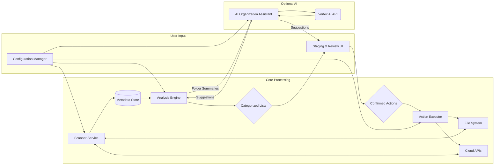

# Architect Specific Memory
<!-- Entries below should be added reverse chronologically (newest first) -->

## Exploratory Point Details - [2025-04-29 19:46:07] (Revised for CLI)

### 1. Analysis Categories Expansion
- **Defined Categories:** Duplicates (hash), Large Files (size threshold), Old Files (date threshold), Similar Files (content-based: fuzzy hash/TF-IDF for docs, pHash for images/video, acoustic fingerprint for audio), Temporary Files (pattern/age), Cache Files (location/age/size), Zero-Byte Files, Empty Folders, Intermediate Build Files (pattern/location/age), Log Files (pattern/size/age), Orphaned Files (heuristic), Recycle Bin/Trash (location/age).
- **Implementation:** Configurable rules in Analysis Engine, managed via Configuration Manager. CLI commands to list/enable/disable/configure rules.

### 2. Corruption Markers Definition
- **Defined Markers:** Zero-byte, Header/Magic Number mismatch (`python-magic`), Type-Specific Validation (Archive listing via `zipfile.testzip()`, PDF page count/structure check via `PyPDF2`/`pymupdf`). Media validation (Pillow/ffmpeg) optional due to complexity/dependencies.
- **Implementation:** Checks performed by Analysis Engine, results flagged in metadata (`analysis_flags`). CLI report can filter by corruption flags.

### 3. Disorganization Metrics Definition
- **Defined Metrics:** Root File Ratio, Average Folder Depth, Shallow Folder Ratio (<N files), Generic Name Ratio (files/folders), Folder Name Redundancy (fuzzy match), Loose File Heuristics (type vs. location).
- **Implementation:** Calculated by Analysis Engine, presented via dedicated CLI report command (e.g., `hygiene report --metrics`).

### 4. UI Approach & Staging Evaluation (Revised)
- **Decision:** CLI-only interface (ADR-001 Revised).
- **Staging Workflow:**
    1. `hygiene scan`: Populates DuckDB.
    2. `hygiene analyze`: Applies rules, updates flags, generates `ActionItem` records (`status='PENDING_CONFIRMATION'`) in DuckDB based on matching transfer/action rules.
    3. `hygiene report --category X > report.txt`: User reviews generated reports/file lists. Uses external tools (`vim`, `less`, `xdg-open`) for detailed inspection based on paths in reports.
    4. `hygiene confirm --category X` or `hygiene confirm --file-list report.txt`: CLI interactively prompts user (Y/N) or non-interactively confirms actions for specified category/list, updating `ActionItem.status` to `CONFIRMED` or `USER_REJECTED`. Requires careful design for safety (e.g., `--yes` flag for non-interactive destructive actions).
    5. `hygiene execute`: Action Executor reads `CONFIRMED` items from DuckDB and performs actions. Progress displayed via `tqdm`/`rich`.
    6. Optional physical staging folder can be configured as a `MOVE_LOCAL` destination in a rule before a separate `DELETE` rule targets that folder after a delay.

### 5. Security Strategy (Credentials) Comparison
- **Decision:** OS Keychain via Python `keyring` library (ADR-002).
- **Flow:** Config Manager uses `keyring`. CLI prompts user via `getpass` or `inquirerpy` password input on first use/set if credentials missing.

### 6. Scalability (Terabytes) Strategies
- **Metadata Store:** DuckDB (ADR-003).
- **Scanning:** Parallel processing (`multiprocessing`) feeding dedicated DB Writer Process via Queue. Incremental scans (mod time/size) (ADR-004).
- **Analysis:** DuckDB queries for filtering/grouping. Optional `ProcessPoolExecutor` for heavy tasks (similarity hashing).
- **APIs:** Batching via SDKs, exponential backoff/retry logic (`tenacity`).

### 7. Error Handling Examples & Logging
- **Strategy:** Standard `logging` module. FileHandler (DEBUG+) to `~/.storage_hygiene/hygiene.log`. StreamHandler (INFO+) to stderr via `rich.print` for user visibility.
- **Examples:** As before, but user feedback via stderr/log file. CLI exit codes indicate success/failure.

### 8. AI Integration Plan
- **Timing:** Post-MVP (ADR-006).
- **Integration:** `AI Organization Assistant` component called optionally by `Analysis Engine`. Suggestions stored in `FileMetadata.ai_suggestion`. CLI command `hygiene report --ai-suggestions` to display. Confirmation/execution follows standard workflow.
- **Privacy:** Metadata only.

### 9. Cloud/Local Transfer Mechanism (Revised)
- **Mechanism:** Generalized rule-based transfers (ADR-007) using direct SDKs/libs via `Action Executor`, staging locally for indirect paths (ADR-005 Revised).
- **Error Handling:** Retry logic, detailed logging to file and `ActionItem.result_message`, progress via CLI.

### 10. Duplicate/Similar File Detection
- **Exact Duplicates:** SHA-256 hash comparison (Scanner calculates, Analyzer queries `GROUP BY`).
- **Similar Files:** Implemented by `Analysis Engine` using `imagehash`, `ssdeep`, `pyacoustid` (+`fpcalc`), potentially TF-IDF (`scikit-learn`). CPU-intensive, run in separate process pool. Results stored as flags/similarity group IDs in `FileMetadata`.

### 11. Cross-Platform (Windows/Linux)
- **Strategy:** Python core, `pathlib`, `keyring`, `send2trash`, `appdirs` (for config/log paths). CLI libraries (`click`/`typer`, `rich`, `tqdm`) are cross-platform. External dependencies (`fpcalc`, `ssdeep` C lib) need platform-specific installation instructions.

## Data Models - [2025-04-29 19:46:07] (Revised)

### Data Model: FileMetadata
- **Purpose**: Represents a single file/folder scanned by the system, stored in DuckDB.
- **Structure**:
  ```sql
  CREATE TABLE FileMetadata (
    id BIGINT PRIMARY KEY, -- Use high-entropy ID generated during scan? Or AUTOINCREMENT?
    scan_session_id VARCHAR, -- Identifier for the scan run
    full_path VARCHAR UNIQUE NOT NULL, -- Full absolute path
    is_directory BOOLEAN NOT NULL,
    size_bytes BIGINT,
    created_time TIMESTAMP,
    modified_time TIMESTAMP,
    accessed_time TIMESTAMP,
    owner VARCHAR, -- OS-specific, may be UID/SID
    -- group VARCHAR, -- OS-specific, may be GID (Removed for simplicity unless needed)
    permissions VARCHAR, -- OS-specific representation (e.g., octal string)
    mime_type VARCHAR, -- Detected MIME type (e.g., via python-magic)
    sha256_hash VARCHAR, -- SHA-256 hash of file content (NULL for dirs/errors)
    similarity_hash VARCHAR, -- Combined field or separate? e.g., pHash:value, fuzzy:value (NULL otherwise)
    similarity_group_id VARCHAR, -- ID linking similar files (NULL otherwise)
    analysis_flags LIST(VARCHAR), -- List of flags (DuckDB LIST type)
    disorganization_metric_flags LIST(VARCHAR), -- List of flags (DuckDB LIST type)
    ai_suggestion VARCHAR, -- Text of suggestion from AI Assistant (Post-MVP)
    last_seen TIMESTAMP NOT NULL, -- Timestamp of the last scan this file was seen in
    first_seen TIMESTAMP NOT NULL -- Timestamp of the first scan this file was seen in
  );
  ```
- **Relationships**: Belongs to a ScanSession (optional table). Referenced by ActionItem.
- **Indexing Notes:** Indexes on `full_path`, `sha256_hash`, `modified_time`, `size_bytes`, `last_seen`. Potential array containment indexes on `analysis_flags` (check DuckDB support/performance).

### Data Model: ActionItem
- **Purpose**: Represents a suggested or confirmed action based on analysis and rules, stored in DuckDB.
- **Structure**:
  ```sql
  CREATE TABLE ActionItem (
    id BIGINT PRIMARY KEY, -- Or AUTOINCREMENT
    file_id BIGINT NOT NULL REFERENCES FileMetadata(id),
    rule_name VARCHAR, -- Name of the rule from config that triggered this suggestion
    action_type VARCHAR NOT NULL, -- e.g., 'DELETE', 'MOVE_TRASH', 'COPY_LOCAL', 'MOVE_LOCAL', 'COPY_CLOUD', 'MOVE_CLOUD', 'KEEP'
    -- source_path VARCHAR NOT NULL, -- Can get from file_id join
    target_path VARCHAR, -- Destination path for COPY/MOVE actions (from rule)
    status VARCHAR NOT NULL, -- 'PENDING_CONFIRMATION', 'CONFIRMED', 'IN_PROGRESS', 'COMPLETED', 'FAILED', 'SKIPPED', 'USER_REJECTED'
    result_message VARCHAR, -- Log message/error details
    suggestion_time TIMESTAMP NOT NULL, -- When the suggestion was generated by Analysis Engine
    confirmation_time TIMESTAMP, -- When the action was confirmed by the user via CLI
    execution_time TIMESTAMP -- When the action was completed/failed
  );
  ```
- **Relationships**: References a FileMetadata record. Logically linked to a rule defined in the configuration.
- **Indexing Notes:** Indexes on `status`, `file_id`, `rule_name`.

## Interface Definitions - [2025-04-29 19:46:07] (Revised for CLI)

### Interface Definition: Scanner Output Queue Item
- **Purpose**: Data passed from Scanner workers to DB Writer process.
- **Format**: Python dictionary representing a `FileMetadata` record.
- **Producer**: Scanner Service Worker Processes
- **Consumer**: DB Writer Process

### Interface Definition: CLI Reports
- **Purpose**: Formatted output for user review.
- **Format**: `rich.Table` for console display, plain text lists (paths), CSV, or JSON for file output. Generated via DuckDB queries based on CLI arguments.
- **Producer**: CLI Reporting functions (querying DuckDB)
- **Consumer**: Standard Output (Console) / Files / User

### Interface Definition: Executor Input Query
- **Purpose**: Fetch confirmed actions for the Executor.
- **Format**: SQL Query `SELECT ai.*, fm.full_path as source_path FROM ActionItem ai JOIN FileMetadata fm ON ai.file_id = fm.id WHERE ai.status = 'CONFIRMED'`. Returns list of dicts/objects.
- **Producer**: Action Executor
- **Consumer**: DuckDB

## System Diagrams - [2025-04-29 19:46:07]

### Diagram: Storage Hygiene System (CLI Detailed) - [2025-04-29 19:46:07]
- Description: Detailed component interaction diagram focusing on CLI, DuckDB, OS Keychain, parallel scanning, generalized rules, and refined analysis flow.
```mermaid
graph LR
    subgraph User Interaction
        direction TB
        CLI[CLI Interface (click/typer)];
        CLI -- Manages --> Config;
        CLI -- Triggers --> ScanPool;
        CLI -- Triggers --> Analysis;
        CLI -- Triggers --> Executor;
        CLI -- Displays Reports/Progress --> User((User));
        User -- Provides Input/Commands --> CLI;
        User -- Reviews Files --> ExternalTools[External Editors/Viewers];
        CLI -- Provides File Paths --> ExternalTools;
    end

    subgraph Configuration
        direction TB
        Config[Configuration Manager] -- Reads --> ConfigFiles(YAML - Rules, Paths);
        Config -- Get/Set Credentials --> OSKeychain[(OS Keychain via 'keyring')];
    end

    subgraph Core Engine
        direction TB
        ScanPool[Scanner Pool (multiprocessing)];
        ScanPool -- Writes Metadata Queue --> DBWriter[DB Writer Process];
        DBWriter -- Writes/Updates --> MetaDB[(DuckDB Metadata Store)];
        Analysis[Analysis Engine] -- Reads/Updates --> MetaDB;
        Executor[Action Executor] -- Reads Actions / Updates Status --> MetaDB;
    end

    subgraph Data Sources & Targets
        direction TB
        FS[Local/External Filesystem];
        OneDriveAPI[MS Graph API];
        GDriveAPI[Google Drive API];
        VertexAIAPI[Vertex AI API (Post-MVP)];
        Trash[OS Trash (send2trash)];
    end

    subgraph Optional AI (Post-MVP)
        direction TB
        AIAssist[AI Organization Assistant];
        AIAssist -- Gets Key --> Config;
        AIAssist -- Calls --> VertexAIAPI;
        Analysis -- Sends Metadata Summary --> AIAssist;
        AIAssist -- Returns Suggestions --> Analysis; %% Suggestions stored in DB
    end

    %% Connections
    Config -- Provides Config --> ScanPool;
    Config -- Provides Config --> Analysis;
    Config -- Provides Config --> Executor;
    Config -- Provides Config --> AIAssist;

    ScanPool -- Scans --> FS;
    ScanPool -- Scans --> OneDriveAPI;
    ScanPool -- Scans --> GDriveAPI;
    ScanPool -- Gets Credentials --> Config;

    Analysis -- Uses Rules From --> Config;
    Analysis -- Gets Credentials (for AI) --> Config;

    Executor -- Acts On --> FS;
    Executor -- Acts On --> Trash;
    Executor -- Acts On --> OneDriveAPI;
    Executor -- Acts On --> GDriveAPI;
    Executor -- Gets Credentials --> Config;
    Executor -- Uses Rules From --> Config;

    %% Style
    classDef db fill:#f9f,stroke:#333,stroke-width:2px;
    classDef api fill:#ccf,stroke:#333,stroke-width:2px;
    classDef secure fill:#f96,stroke:#333,stroke-width:2px;
    class MetaDB,OSKeychain,OneDriveAPI,GDriveAPI,VertexAIAPI db;
    class OSKeychain secure;
```
**Notes:** CLI-focused architecture. Parallel scanning feeds a dedicated DB writer. Analysis and Execution interact primarily with DuckDB based on configuration rules. Credentials use OS Keychain. AI is optional.

## Component Specifications - [2025-04-29 19:46:07] (Revised & Detailed)

### Component Specification: CLI Interface - [2025-04-29 19:46:07]
- **Responsibility**: Parse user commands (`scan`, `analyze`, `report`, `confirm`, `execute`, `config`), orchestrate calls to core components, display formatted output/progress, handle interactive confirmation.
- **Dependencies**: `click`/`typer`, `rich`, `tqdm`/`rich.progress`, `inquirerpy`, `Configuration Manager`, `Scanner Service`, `Analysis Engine`, `Action Executor`, `Metadata Store` (for reporting).
- **Interfaces Exposed**: Command Line Interface. Stdout/Stderr.
- **Internal Structure**: Command definitions using `click`/`typer`. Functions orchestrate backend calls. Output formatting using `rich`. Progress via `tqdm`/`rich`. Confirmation via `inquirerpy`.
- **Error Handling**: Catch backend exceptions, display user-friendly errors (`rich.print`). Handle argument errors. Use exit codes.
- **SPARC/TDD Alignment**: TDD for command parsing (`CliRunner`), output formatting. Interface tests verify orchestration logic.

### Component Specification: Scanner Service (Pool) - [2025-04-29 19:46:07]
- **Responsibility**: Parallel traversal (local/cloud), metadata gathering (`stat`, SDKs), SHA-256 hashing (`hashlib`), incremental checks (DB query `mtime`/`size`), put results on DB Writer queue.
- **Dependencies**: `multiprocessing`, `pathlib`, `os`, `hashlib`, `Configuration Manager`, `Metadata Store` (read-only connection for checks), Cloud SDKs, `DB Writer Process Queue`.
- **Interfaces Exposed**: Accepts config. Internal: Puts dicts on `Queue`.
- **Internal Structure**: `Pool` + `Queue`. Workers use `imap_unordered`, query DB, stat/hash if needed, put result. Dedicated DB writer process consumes queue.
- **Error Handling**: Log skips (permissions, API errors). Handle auth errors early. Retry transient cloud errors (`tenacity`).
- **SPARC/TDD Alignment**: TDD for stat collection, hashing, incremental logic. Mock `os.walk`, SDKs, DB connection. Integration tests with small dirs/mock endpoints.

### Component Specification: DB Writer Process - [2025-04-29 19:46:07]
- **Responsibility**: Dedicated process consuming `FileMetadata` dicts from queue, performing batch upserts into DuckDB `FileMetadata` table.
- **Dependencies**: `multiprocessing` (Queue), `duckdb`.
- **Interfaces Exposed**: Internal: Consumes from `Queue`.
- **Internal Structure**: Loop reading queue, batch items, perform `INSERT ... ON CONFLICT (full_path) DO UPDATE SET ...`. Manage DB connection.
- **Error Handling**: Handle DB exceptions (log, manage failed batch).
- **SPARC/TDD Alignment**: Infrastructure. Test via queue input -> DB state verification. Mock `duckdb.connect`.

### Component Specification: Analysis Engine - [2025-04-29 19:46:07]
- **Responsibility**: Apply analysis rules (duplicates, size, age, patterns). Perform similarity (pHash, fuzzy, acoustic via worker pool). Perform corruption checks (header, archive, pdf). Calculate disorganization metrics. Match files against transfer rules. Update `FileMetadata` flags. Generate `ActionItem` records (`status='PENDING_CONFIRMATION'`).
- **Dependencies**: `Metadata Store` (DuckDB R/W), `Configuration Manager`, `concurrent.futures.ProcessPoolExecutor`, Analysis Libraries (`imagehash`, `ssdeep`, `pyacoustid`+`fpcalc`, `python-magic`, `zipfile`, `PyPDF2`), `pydantic`/`jsonschema`. Optional: `scikit-learn`.
- **Interfaces Exposed**: Triggered by CLI. Reads/Writes DuckDB.
- **Internal Structure**: Iterate rules. Use DuckDB SQL for filtering/grouping. Dispatch heavy tasks (similarity) to pool. Generate `ActionItem` SQL `INSERT` statements. Update `FileMetadata` flags via `UPDATE`.
- **Error Handling**: Catch analysis library exceptions. Handle DB errors. Log issues. Mark files with analysis errors.
- **SPARC/TDD Alignment**: Core logic. TDD for each rule/check (mocking DB/libs). Use sample data.

### Component Specification: Action Executor - [2025-04-29 19:46:07]
- **Responsibility**: Read `CONFIRMED` `ActionItem` records. Execute actions (delete, trash, copy/move local/cloud) based on item/rule details. Use local staging for indirect transfers. Implement retries (`tenacity`). Update `ActionItem` status/message in DuckDB.
- **Dependencies**: `Metadata Store` (DuckDB R/W), `Configuration Manager`, `send2trash`, `shutil`, `os`, `pathlib`, `tempfile`, Cloud SDKs, `tenacity`. Optional: `subprocess`.
- **Interfaces Exposed**: Triggered by CLI. Reads/Writes DuckDB. Interacts with FS/Cloud APIs/Trash.
- **Internal Structure**: Fetch actions. Loop: select function based on `action_type`/source/dest. Use `send2trash`, `shutil`, SDKs (with retries). Manage `tempfile` staging. Update DB status.
- **Error Handling**: Catch FS/SDK/API errors (permissions, not found, disk full, rate limits). Log errors to `result_message`. Handle conflicts (skip/rename/overwrite).
- **SPARC/TDD Alignment**: Core action logic. TDD for each action type (mocking FS/SDKs/DB). Test retries. Integration tests with `pyfakefs`/mock APIs.

### Component Specification: Configuration Manager - [2025-04-29 19:46:07]
- **Responsibility**: Load/Save/Validate config (YAML - `PyYAML`, `pydantic`/`jsonschema`). Securely manage credentials (OS Keychain - `keyring`). Provide config/credentials via API. Support CLI updates.
- **Dependencies**: `PyYAML`, `keyring`, `pydantic`/`jsonschema`, `pathlib`, `appdirs` (for default config location).
- **Interfaces Exposed**: Python API (`get_rule`, `get_credential`), CLI (`hygiene config`).
- **Internal Structure**: Class loads/validates YAML (from default location like `~/.config/storage-hygiene/config.yaml` or specified path). Provides getters. Uses `keyring` for secrets, prompts via CLI if needed. Saves non-sensitive config.
- **Error Handling**: Handle file I/O, parsing, validation, `keyring` errors. Clear CLI messages. Create default config if missing.
- **SPARC/TDD Alignment**: Foundational. TDD for load/save/validation/credential logic. Mock `keyring`, filesystem, `appdirs`.

### Component Specification: Metadata Store (DuckDB) - [2025-04-29 19:46:07]
- **Responsibility**: Persist `FileMetadata`, `ActionItem`. Provide efficient SQL querying.
- **Dependencies**: `duckdb`.
- **Interfaces Exposed**: SQL via `duckdb` connections.
- **Internal Structure**: Single DB file (e.g., `~/.local/share/storage-hygiene/metadata.duckdb` via `appdirs`). Schema defined. Indexes.
- **Error Handling**: Handled by clients. Backups recommended.
- **SPARC/TDD Alignment**: Data layer. Interactions tested via mocking.

### Component Specification: AI Organization Assistant (Optional, Post-MVP) - [2025-04-29 19:46:07]
- **Responsibility**: Construct prompts from metadata summaries, call Vertex AI (`google-cloud-aiplatform`), parse suggestions, store in `FileMetadata.ai_suggestion`.
- **Dependencies**: `Analysis Engine`, `Configuration Manager`, `google-cloud-aiplatform`.
- **Interfaces Exposed**: Internal Python API.
- **Internal Structure**: Prompt generation, API call (with retries), response parsing.
- **Error Handling**: Handle API/parsing errors. Log issues.
- **SPARC/TDD Alignment**: Extensibility. TDD for prompt/parsing logic. Mock API calls.

## Potential Future Features - [2025-04-29 19:46:07]
- More cloud providers (Dropbox, Box, S3...).
- Plugin system (analysis rules, actions, report formats).
- Undo functionality (staging/logging).
- Scheduled scans (`cron`/Task Scheduler/internal).
- Advanced reporting (HTML, CSV/JSON export).
- Filesystem health monitoring (SMART).
- Advanced corruption detection.
- Password manager integration.
- Cross-location deduplication.
- TUI interface (optional alternative).

---
*(Historical Entries Below)*
---

## System Diagrams

### Diagram: Storage Hygiene System - 2025-04-29 18:51:32
*(Keeping previous diagram for history)*
- Description: High-level data flow between components of the storage hygiene system.

**Notes:** Metadata Store might be in-memory for smaller scans or a simple database/file for larger ones. Cloud APIs refer to OneDrive (Graph API) and Google Drive API. Secure credential management is essential for Config, Executor, and AI components.

## Component Specifications

### Component Specification: Scanner Service - 2025-04-29 18:51:32
*(Keeping previous spec for history)*
- **Responsibility**: Traverse configured locations (local, external, cloud), gather file metadata (path, size, type, dates, hash), handle access errors.
- **Dependencies**: File System, Cloud APIs (OneDrive, Google Drive), Configuration Manager (for paths, credentials).
- **Interfaces Exposed**: Accepts scan configuration, outputs file metadata records.
- **Internal Structure (Optional High-Level)**: Uses `os`/`pathlib` for local, cloud SDKs for cloud, `hashlib` for hashes. Needs robust error handling.

### Component Specification: Analysis Engine - 2025-04-29 18:51:32
*(Keeping previous spec for history)*
- **Responsibility**: Process metadata, apply rules (duplicates, size, age, type, corruption markers), perform organizational analysis (potentially via AI), categorize files.
- **Dependencies**: Metadata Store, Configuration Manager (for rules), AI Organization Assistant (optional).
- **Interfaces Exposed**: Consumes metadata, outputs categorized file lists (e.g., `to_delete`, `to_review`, `to_migrate_gdrive`).
- **Internal Structure (Optional High-Level)**: Rule engine or conditional logic, potentially data processing libraries (e.g., Pandas).

### Component Specification: Staging & Review UI - 2025-04-29 18:51:32
*(Keeping previous spec for history)*
- **Responsibility**: Present categorized lists to user, allow review/approval/rejection of actions, display file details/previews.
- **Dependencies**: Analysis Engine (for lists).
- **Interfaces Exposed**: Consumes categorized lists, outputs confirmed action lists.
- **Internal Structure (Optional High-Level)**: Could be CLI, Web App, or Desktop App.

### Component Specification: Action Executor - 2025-04-29 18:51:32
*(Keeping previous spec for history)*
- **Responsibility**: Execute confirmed actions (delete, move local, upload to cloud, cloud-to-cloud via download/upload), log results.
- **Dependencies**: Staging & Review UI (for confirmed actions), File System, Cloud APIs, Configuration Manager (for credentials).
- **Interfaces Exposed**: Consumes action lists, outputs action logs.
- **Internal Structure (Optional High-Level)**: Uses `os`/`shutil` for local, cloud SDKs for cloud. Requires careful error handling and logging.

### Component Specification: Configuration Manager - 2025-04-29 18:51:32
*(Keeping previous spec for history)*
- **Responsibility**: Manage settings (paths, rules), securely store credentials (OS keychain/env vars recommended, **NOT plain text files**).
- **Dependencies**: Secure storage mechanism (OS keychain, etc.).
- **Interfaces Exposed**: Provides configuration to other services, potentially UI/CLI for editing.
- **Internal Structure (Optional High-Level)**: Reads config files (YAML/JSON) for non-sensitive data, interacts with secure credential store.

### Component Specification: AI Organization Assistant (Optional) - 2025-04-29 18:51:32
*(Keeping previous spec for history)*
- **Responsibility**: Interact with LLM (Gemini via Vertex AI) using folder summaries/metadata to get organizational suggestions.
- **Dependencies**: Analysis Engine (for input data), Vertex AI API, Configuration Manager (for API key).
- **Interfaces Exposed**: Consumes metadata/summaries, outputs suggestions to Analysis Engine or UI.
- **Internal Structure (Optional High-Level)**: Uses Google Cloud Vertex AI client library. Requires secure API key management.