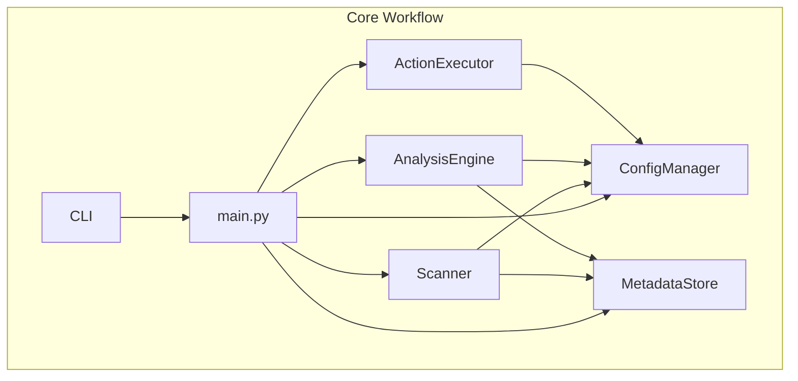

# Integration Specific Memory
<!-- Entries below should be added reverse chronologically (newest first) -->

## Integration Test Scenarios
### Scenario: Main Workflow Dry Run - 2025-04-29 23:45:11
- **Components**: `main.py`, `ConfigManager`, `MetadataStore`, `Scanner`, `AnalysisEngine`, `ActionExecutor`
- **Steps**: 1. Create test config, dummy files (duplicate, large, old). 2. Run `main.py` via `subprocess` with `--dry-run`, test config, test DB path, and scan dir args. 3. Assert return code 0. 4. Assert key log messages in stderr. 5. Assert dry-run action messages in stdout. 6. Assert 5 records in DuckDB. 7. Assert staging dir is empty.
- **Expected**: Script runs successfully, identifies 3 actions (duplicate, large, old), logs dry-run actions, creates DB with 5 records, leaves staging empty.
- **Status**: Auto
- **Last Run**: 2025-04-29 23:45:11 - PASS

## System Dependency Map
### Dependency Map (Current - Overwrite this section) - 2025-04-29 23:45:11

## Integration Points Catalog
### Point: Main Script Orchestration - 2025-04-29 23:45:11
- **Components**: `main.py` ↔ `ConfigManager`, `MetadataStore`, `Scanner`, `AnalysisEngine`, `ActionExecutor`
- **Type**: Function Call / Object Instantiation
- **Contract**: Python class constructors and methods (`__init__`, `scan_directory`, `analyze`, `execute_actions`, `get`, `query_files`, `upsert_file_record`, `get_duplicates`)
- **Data Flow**: `main.py` instantiates components, passing config/store instances. `Scanner` populates `MetadataStore`. `AnalysisEngine` reads `MetadataStore` & `ConfigManager`. `ActionExecutor` receives analysis results & reads `ConfigManager`.
- **Protocol**: N/A (In-process Python calls)
- **Deps**: `argparse`, `logging`, `pathlib`, `duckdb`, `yaml`
- **Status**: Tested (Dry Run)
- **Issues**: Multiple interface mismatches identified and fixed during testing (See test run history).

## Integration Release Notes
<!-- Append release notes using the format below -->

## Integration Issues Log
<!-- Append issues using the format below -->